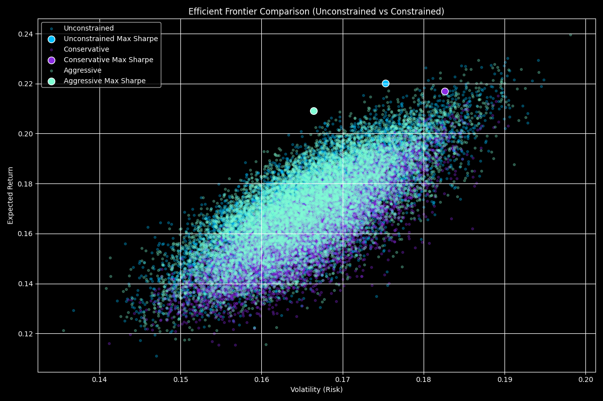

# Smart Portfolio Optimizer

A Python-based tool designed to explore how real-world constraints affect portfolio performance, diversification, and risk exposure. Using historical data from 20 diversified assets, including stocks, ETFs, crypto, and commodities. the optimizer runs thousands of Monte Carlo simulations to evaluate each portfolio’s **expected return**, **volatility**, and **Sharpe ratio**.

The goal was to explore a core question in portfolio management:  
**How do constraints like sector caps or asset limits shape investment outcomes compared to purely performance-driven strategies?**  
This tool simulates that trade-off across three strategies: **unconstrained**, **conservative**, and **aggressive**.

---

## Key insights:
- **Unconstrained portfolios** lean heavily into **Technology and Alternatives**, chasing past returns at the cost of higher volatility.
- **Conservative portfolios** result in more balanced allocations, with stricter caps forcing exposure to underweighted sectors like **Consumer** and **Healthcare**.
- The **aggressive strategy** finds a middle ground, still favoring high-return sectors, but maintaining diversification.

These results highlight how constraint-aware optimization can lead to better risk-adjusted outcomes depending on an investor’s objective, whether that's maximizing growth, managing downside risk, or meeting policy requirements.

---

## Key Features

- Real financial data from 2019–2024
- Monte Carlo simulation with thousands of portfolios
- Sector and asset allocation constraints
- Easy-to-read allocation charts (pie + bar)
- Clean, modular Python code ready for extension

---

## Visuals

### Asset Correlation Heatmap

Before running any simulations, I started by checking how the selected assets move relative to one another. This correlation heatmap helps assess the level of diversification across the portfolio by showing how closely assets move in relation to one another.

Each square represents the correlation between a pair of assets. A value near 1 (deep red) means they tend to move together, while values near 0 or negative (deep blue) indicate weaker or even opposite relationships. If the chart were mostly red, it would suggest that the assets behave similarly, reducing the benefits of diversification.

In this case, the chart shows a healthy range of correlations. While assets within the same sector (like tech stocks) show stronger relationships, there are plenty of weaker correlations across sectors. This confirms that the portfolio includes a good mix of assets that don't all move in sync, which is essential for managing risk effectively.


### Efficient Frontier Comparison

This plot visualizes the results of 10,000 randomly generated portfolios under each strategy: unconstrained, conservative, and aggressive. Each dot represents a portfolio with a specific expected return and volatility, and the larger highlighted points mark the ones with the highest Sharpe ratio within each strategy.

Rather than plotting a theoretical frontier, we simulate real-world portfolios to show how return and risk actually distribute when constraints are applied. The upper boundary of the cloud of points effectively traces the empirical efficient frontier, the limit of performance for a given level of risk.

This plot is especially useful to see how different constraints shift and compress the frontier. For example, the conservative strategy produces safer portfolios, but sacrifices some potential return, while the unconstrained one pushes further into high-risk, high-return territory.



### Sector Allocation — Unconstrained

This chart shows the sector composition of the optimal unconstrained portfolio, the one with the highest Sharpe ratio when the optimizer was given complete freedom.

Without any limits on how much can be invested in a single asset, sector, or asset class, the optimizer leans heavily into the sectors that historically performed best. Here, Technology (23.4%), Alternatives (22.9%), and Industrials (18.6%) take the lead, together making up nearly two-thirds of the portfolio. This is a classic example of return-chasing behavior when no real-world constraints are applied.

That said, we still see some natural diversification. Healthcare (14.5%), ETFs (10.6%), and even small allocations to Consumer and Energy remain in the mix. This diversification isn’t imposed by constraints; it naturally emerges from the optimizer’s attempt to maximize the Sharpe ratio. Even in a purely performance-driven setup, allocating across multiple sectors helps reduce risk and smooth out returns.


### Sector Allocation — Conservative

In the conservative allocation, the optimizer responded to tighter constraints by distributing weight more evenly across sectors. Technology, Industrials, and Consumer sectors remain prominent, but no single area dominates the portfolio. Alternatives are capped below 10%, and sectors like Energy and Healthcare receive modest but meaningful exposure.

This distribution reflects a common institutional mindset, one that favors risk management and avoids over-concentration. It’s the kind of allocation you’d expect from a long-term investor or retirement fund, where preserving capital and ensuring stable growth matter more than chasing maximum returns.


### Sector Allocation — Aggressive

In the aggressive allocation, we gave the optimizer more breathing room, slightly relaxed constraints allow it to chase higher returns while still maintaining basic diversification. The result is a noticeable tilt toward Technology (27.4%) and Alternatives (18.4%), both of which tend to offer greater upside potential but also come with higher volatility.

Industrials hold a strong presence as well, suggesting the optimizer sees value in sectors that blend cyclical growth with relative stability. Meanwhile, lower allocations in Financials and Energy reflect a tactical decision to minimize drag in pursuit of better Sharpe ratios.

This kind of portfolio could appeal to investors with a higher risk tolerance, those aiming for long-term growth, comfortable with drawdowns, and willing to ride out market swings in exchange for better performance.


### Side-by-Side Portfolio Weights

This horizontal bar chart compares the individual asset weights across the three strategies: unconstrained, conservative, and aggressive. Each bar shows how much of a given asset makes it into the final optimized portfolio under each set of constraints.

Some clear patterns emerge. For example, BTC-USD and GLD (crypto and gold) receive much higher weights in the unconstrained setup, where maximizing performance takes priority. In contrast, the conservative version distributes weights more evenly, avoiding concentration and adhering to stricter caps.

This visualization helps us analyze how constraint logic affects specific investment decisions. It makes it easy to spot which assets are consistently favored, which get trimmed under risk-aware strategies, and how the optimizer balances high-return opportunities against exposure limits.


---

## Conclusion

This project was designed to model how practical constraints, such as limits on individual assets, sector exposure, and alternative investments, affect portfolio construction and performance. By simulating thousands of portfolios using historical data, we quantified how different strategies shift the balance between return and risk.

The analysis reveals that unconstrained optimization tends to overweight high-growth sectors like Technology and Alternatives, often leading to concentrated portfolios with elevated volatility. In contrast, constraint-aware strategies, particularly the conservative allocation, produce more balanced and diversified outcomes, aligning more closely with the risk management priorities of institutional investors.

These findings reinforce a core principle in portfolio management: constraints are not merely limitations, but tools for shaping portfolios that are resilient, compliant, and aligned with long-term objectives. This optimizer provides a clear framework for evaluating those trade-offs and designing portfolios that reflect both performance goals and operational realities.


---

## Tech Stack

- Python (Pandas, NumPy, Matplotlib, Seaborn)
- Yahoo Finance API via `yfinance`
- PyCharm for development

---

## Contact

Feel free to connect:

[LinkedIn](https://www.linkedin.com/in/matteo-sasek-martins)  
[GitHub](https://github.com/sasekmatteo)

---

## How to Run

Clone the repo and run:

```bash
pip install -r requirements.txt
python main.py
